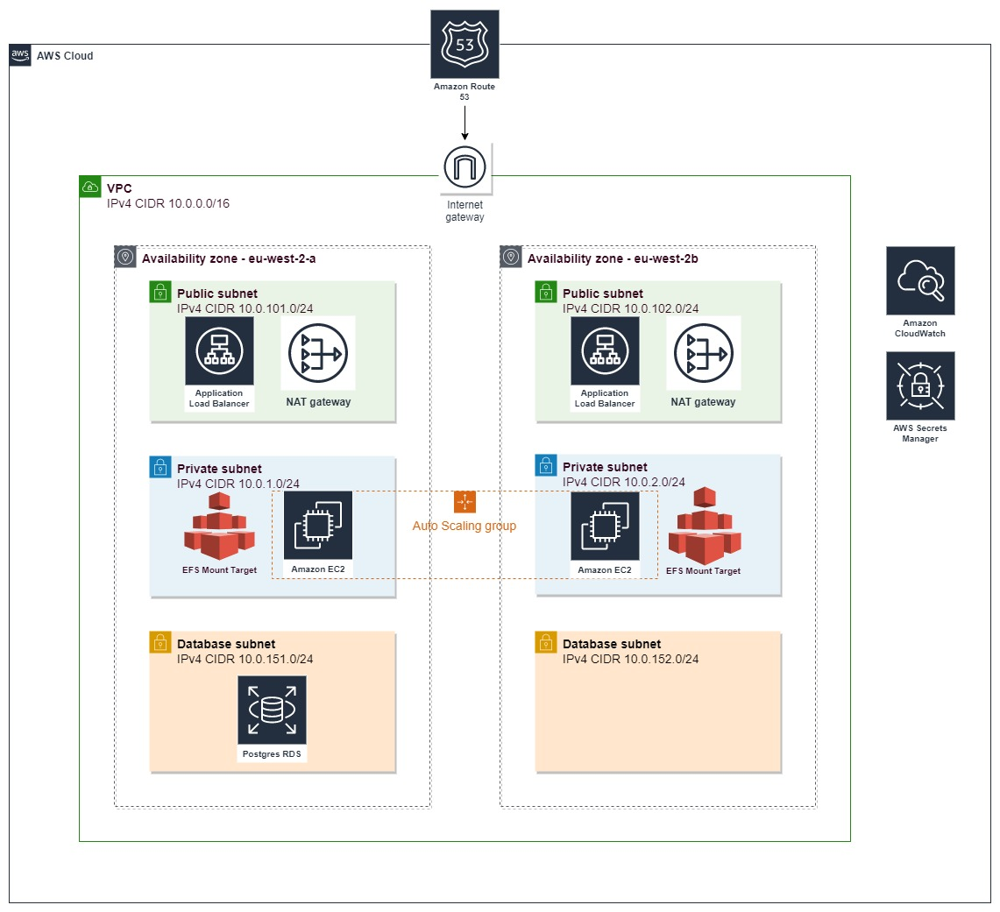

# Task Description

We'd like you to create a solution using Terraform that sets up a simple web app on Amazon EC2. The web app itself doesn't matter: Node, and PHP, it doesn't matter as long as it exposes a web interface.
Make sure the site is load balanced using an ELB and connects to an RDS instance that's not publicly reachable.
Please use EFS for shared storage between the two nodes. Add at least a CloudWatch alarm that triggers when the total number of requests exceeds X.

## Bonus Points

The following is optional and will get you bonus points:

setup autoscaling
do the above in ECS

